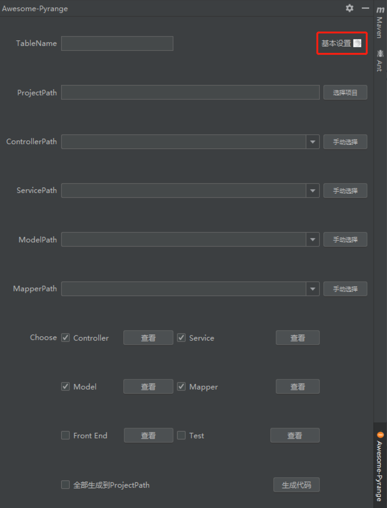
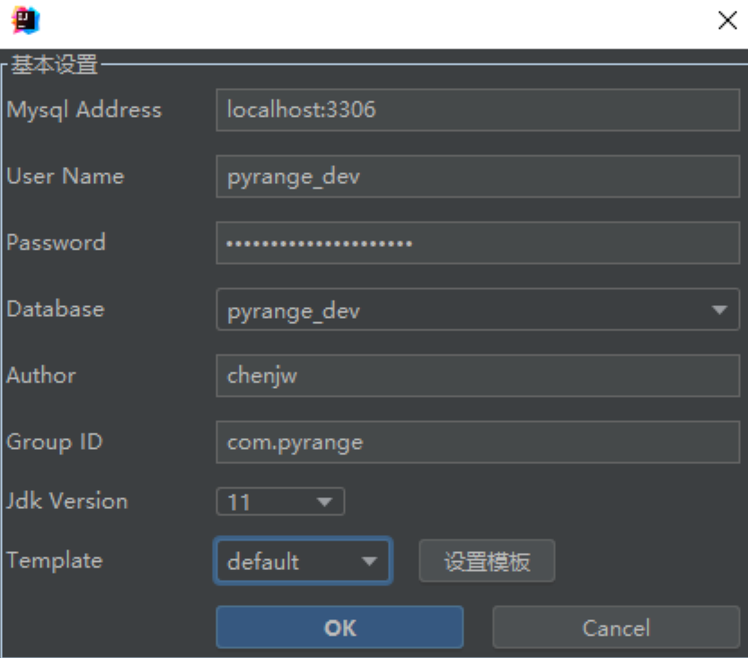
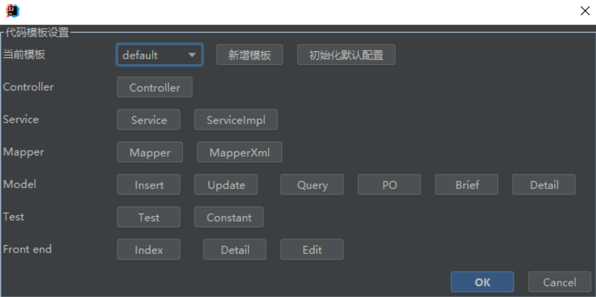

# 使用教程
本工具通过数据库表字段名, 注释等信息生成增删改查基本代码, 需要配置数据库等信息

## 首先点击【基本设置】, 完成基本配置

此处配置开发环境数据库, 开发者名字, JDK 版本, 默认模板集等.

## 配置模板
不同技术环境代码风格也不一样, 使用者可以设置自己的专有模板

可以点击相应代码按钮, 修改模板内容, 语法参考 [FreeMarker](https://freemarker.apache.org/)

# 常见问题
1. 修改模板后, 因语法错误, 导致工具报错  
答: 参考错误信息, 修改模板, 或简单重置模板配置即可

3. 生成代码后, 新增字段怎么同步  
答: 可以点击工具首页, 快速查看相应代码, Ctrl CV; 如果只是同步 model, 可以覆盖现有代码, 但是 Controller, Service 之类包含业务代码的不建议这么操作

## 其它
参数配置表后续更新

